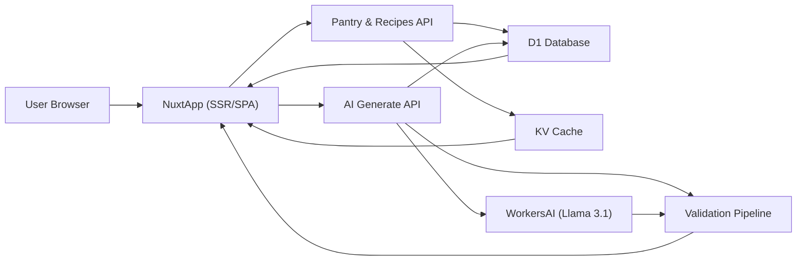

## Recipe Remix Engine

[](https://github.com/charliegucci/recipe-remix/actions/workflows/deploy.yml)
[](https://github.com/charliegucci/recipe-remix/actions/workflows/preview.yml)
[](https://github.com/charliegucci/recipe-remix/actions/workflows/ci.yml)
[](https://github.com/charliegucci/recipe-remix/actions/workflows/smoke-tests.yml)

Turn whatever's already in your kitchen into creative, trustworthy fusion recipes. Recipe Remix Engine is a Nuxt 4 + Cloudflare web app that takes your pantry ingredients, dietary restrictions, and cuisine preferences and generates cross‑cuisine mashups – with food‑safety validation and clear culinary reasoning.

---

### Features

- **Pantry-driven cooking**
  - Add ingredients via search/autocomplete
  - Save a persistent **My Pantry** list so you don’t re-enter every session
- **Dietary & preference aware**
  - Built-in dietary filters: vegetarian, vegan, gluten-free, dairy-free, nut-free
  - Select favorite cuisines to steer generation (e.g. Italian, Thai, Mexican, Japanese)
- **AI fusion recipes**
  - Hybrid approach: matches against a curated recipe database **plus** AI remixing
  - Cross-cuisine mashups (e.g. Thai–Italian, Mexican–Japanese) and technique remixes
  - AI-generated recipe images for visual inspiration
- **Clear, guided cooking**
  - Step-by-step instructions with time and difficulty levels
  - Serving size scaling with proper fraction display
  - Ingredient substitution suggestions powered by AI
  - “Why this works” explanations that justify flavor and technique choices
- **Accounts and history**
  - Optional account system (email/password + anonymous)
  - Save favorites, view cooking history, and rate/review recipes
- **Production-grade behavior**
  - Food safety validation (ingredients, dietary checks, USDA-safe temperatures)
  - Optimistic UI patterns and resilient error handling
  - KV-backed caching, observability, and analytics suitable for real production usage

---

### Live Status

- **Current milestone:** v1.1 – **Test on Production** — SHIPPED (2026-02-13)
  - Deployed to Cloudflare Pages via NuxtHub with all features validated, UX polished, SEO optimized, and Lighthouse 90+ achieved.
- **v1.0 status:** Shipped (2026‑02‑11) – full-stack MVP with 33/33 requirements satisfied.

- **Production:** https://remix-recipe.com
- **Preview deployments:** Automatically created for pull requests

For deeper planning context, see `.planning/PROJECT.md`, `.planning/STATE.md`, and `.planning/ROADMAP.md`.

---

### Tech Stack

- **Frontend / framework**
  - Nuxt 4 (compat layer, `nuxt.config.ts`)
  - Vue 3
  - Tailwind CSS v4 (via `@tailwindcss/vite`)
- **Backend / infrastructure**
  - Cloudflare Pages + Workers runtime (via NuxtHub)
  - Cloudflare D1 (SQL database) via Drizzle ORM
  - Cloudflare KV for caching
  - Cloudflare R2 for images/blobs
- **Auth & user management**
  - Better Auth (email/password + anonymous sessions)
- **AI**
  - Cloudflare Workers AI
  - Llama 3.1 70B for text (recipes, explanations)
  - `flux-1-schnell` (or similar) for image generation
- **Tooling**
  - TypeScript
  - Drizzle Kit for migrations and schema
  - Wrangler for Cloudflare configuration
  - Lighthouse and bundle-size checks as quality gates

Key configs:
- `nuxt.config.ts` – Nuxt, NuxtHub, Tailwind setup
- `wrangler.jsonc` – Cloudflare D1, KV, and R2 bindings
- `package.json` – scripts and dependency versions

---

### Architecture Overview

At a high level, Recipe Remix Engine uses a **hybrid recipe engine**:

- Curated database recipes for reliability and browseability
- AI generation and remixing for creativity
- Multi-layer validation to keep results safe and on-spec

#### High-level flow



#### Key concepts

- **Hybrid recipes:**  
  The app starts from curated recipes in D1 and ingredients canonicalization tables, then uses AI to:
  - Fill gaps
  - Fuse cuisines
  - Suggest substitutions

- **Caching:**  
  KV provides read-through caching for frequently accessed content (recipes, ingredient metadata), with tiered TTLs for freshness vs. performance.

- **Analytics & observability:**  
  Fire-and-forget analytics calls ensure user flows never block on telemetry; a separate endpoint can be used as a fallback when Workers fire-and-forget is unreliable.

---

### Getting Started (Development)

#### Prerequisites

- **Node.js**: Recommended current LTS (Nuxt 3.15+ compatible)
- **Package manager**: npm, pnpm, or yarn (examples use `npm`)
- **Cloudflare account** with:
  - D1
  - KV
  - R2
  - Workers AI access
- **Wrangler CLI** (should be installed via `devDependencies`):
  - `npx wrangler --version`

#### Install dependencies

```bash
npm install
# or
pnpm install
# or
yarn install
```

#### Environment configuration

You’ll need environment variables for:

- Cloudflare account / project (for NuxtHub + wrangler)
- D1, KV, and R2 bindings (aligned with `wrangler.jsonc`)
- Workers AI access (model IDs, API keys/tokens if needed)
- Better Auth configuration (secrets, cookie/session config, email settings if used)

**Login and register require `BETTER_AUTH_SECRET`** so Better Auth can sign sessions. Generate a value with `openssl rand -base64 32` and add it to `.env`. In development only, if unset, the app uses a dev fallback (see server log); in production the app will error until the secret is set.

Typically this will live in one or more `.env` files depending on your Nuxt/Cloudflare setup, e.g.:

```bash
# .env.example
NUXT_HUB_PROJECT_ID=...
NUXT_HUB_ACCOUNT_ID=...
NUXT_HUB_ENV=development

BETTER_AUTH_SECRET=...   # required for login/register; generate with: openssl rand -base64 32
BETTER_AUTH_URL=http://localhost:3000

CF_ACCOUNT_ID=...
CF_API_TOKEN=...
```

> Check your local setup or deployment configuration for the exact env names currently used; keep `.env` files out of git.

#### Run the dev server

```bash
npm run dev
# Nuxt dev server on http://localhost:3000 by default
```

#### Database workflows

The project uses Drizzle Kit for schema and migrations on top of D1:

```bash
# Generate migration files from schema
npm run db:generate

# Apply migrations
npm run db:migrate

# Optional: visual DB explorer
npm run db:studio

# Seed local data (requires dev server running)
npm run db:seed   # calls POST http://localhost:3000/api/_seed
```

**Recipe slugs and links:** Recipe detail URLs use a `slug` (e.g. `/recipe/spaghetti-carbonara`). The seed script sets slugs when inserting recipes. If your database was created or seeded before slugs were added:

- **Re-seed** so every recipe gets a slug: run `npm run db:seed` again (with the dev server running), or
- **Backfill only:** `POST /api/_seeds/generate-slugs` to generate slugs for recipes that have none.

After backfilling slugs, the featured-recipes carousel may still show cached data (KV key `recipes:featured`, 24h TTL). Either redeploy so cache is cold, or wait for the cache to expire, so the homepage carousel gets recipes with slugs.

#### KV cache: deleted keys and repopulation

All KV usage is **read-through cache**: on a cache miss, the API fetches from D1 (or the source of truth), writes the result to KV, and returns it. If you delete a key in the Cloudflare dashboard (or via script), no redeploy or code change is needed—the **next request** to that endpoint will repopulate the key automatically.

| Key pattern | Endpoint / usage | TTL | Source of truth |
| ----------- | ----------------- | --- | ---------------- |
| `recipes:featured` | `server/api/recipes/featured.get.ts` | 24h | D1 `recipes` where `featured = true` |
| `recipes:list:...` | `server/api/recipes/index.get.ts` | 5min | D1 `recipes` |
| `recipe:{idOrSlug}` | `server/api/recipes/[idOrSlug].get.ts` | 5min | D1 `recipes` |
| `analytics:observability` | `server/api/analytics/observability.get.ts` | 5min | Computed at request time |
| Match-pantry / ingredient-search | match-pantry, ingredients/search | 5min | D1 / computed |

**Force repopulation:** To warm the cache without waiting for traffic, call the corresponding API (e.g. `GET /api/recipes/featured` for the featured carousel, or open the homepage).

**If something is still broken:** If the whole KV namespace was deleted, recreate it in the Cloudflare dashboard and re-bind it in your Pages project (same binding name as in NuxtHub/wrangler, e.g. `KV` / `CACHE`). Then hit the APIs above to repopulate. Confirm the app’s KV binding is attached to the correct namespace in the deployment you’re testing.

---

### Deployment

Recipe Remix is designed to run on **Cloudflare Pages + Workers** via NuxtHub.

#### Automated Deployments (Recommended)

The project uses GitHub Actions for continuous deployment:

- **Production:** Push to `main` branch triggers automatic deployment
- **Preview:** Pull requests automatically generate preview deployments
- **Status:** Check the Actions tab in GitHub for deployment status

**Required GitHub Secrets:**
- `NUXT_HUB_PROJECT_KEY`: Get from NuxtHub project settings → API Keys
- `CLOUDFLARE_API_TOKEN`: Create in Cloudflare dashboard → My Profile → API Tokens → Create Token → Use "Edit Cloudflare Pages" template

**To add secrets:**
1. Go to GitHub repo → Settings → Secrets and variables → Actions
2. Click "New repository secret"
3. Add both `NUXT_HUB_PROJECT_KEY` and `CLOUDFLARE_API_TOKEN`

Once secrets are configured, deployments happen automatically on push.

#### Manual Deployment (Alternative)

High-level steps (exact details may vary slightly with your NuxtHub setup):

1. **Configure wrangler & bindings**
   - `wrangler.jsonc` already defines:
     - D1 database binding `DB`
     - R2 bucket binding `IMAGES`
     - KV namespace binding `CACHE`
   - Ensure these map to real Cloudflare resources in your account (via Cloudflare dashboard or `wrangler d1/kv/r2` commands).

2. **Build the app**

   ```bash
   npm run build
   ```

3. **Deploy with NuxtHub / Cloudflare Pages**
   - Connect the repo to Cloudflare Pages.
   - Use `npm run build` as the build command.
   - Use the appropriate output directory for Nuxt 3 on Pages (NuxtHub handles this).
   - Configure environment variables and bindings in the Cloudflare Pages project settings.

4. **Preview & production**
   - Use preview deployments to test new changes.
   - Once validated, promote to production.
   - Verify:
     - AI generation works
     - D1 reads/writes succeed
     - Images and blobs correctly upload to R2
     - KV caching behaves as expected

---

### Usage Walkthrough

1. **Open the app** (local dev or production URL).
2. **Build your pantry**
   - Start typing ingredients and select from autocomplete options.
   - Save your **My Pantry** so it’s available next time.
3. **Set dietary restrictions**
   - Choose from vegetarian, vegan, gluten-free, dairy-free, nut-free.
4. **Pick cuisines**
   - Select your preferred cuisines (e.g. Italian + Thai).
5. **Generate recipes**
   - The app:
     - Canonicalizes your ingredients
     - Cross-checks dietary filters and food safety constraints
     - Queries the curated recipe DB
     - Calls Workers AI to generate fusion ideas and “Why this works” text
6. **Cook and iterate**
   - Follow step-by-step instructions.
   - Adjust serving sizes.
   - Use suggested substitutions if you’re missing something.
   - Save favorites and leave ratings/reviews if you’re signed in.

---

### AI, Validation & Food Safety

This project intentionally **separates creativity from safety**:

- **AI generation** is encouraged to be creative about:
  - Pairing cuisines
  - Using non-traditional techniques
  - Suggesting flavor twists
- **Validation pipeline** then checks:
  - Dietary restriction violations (ingredients and steps)
  - Ingredient sanity (known pantry items, canonicalization)
  - Food safety basics, including USDA-safe cooking temperatures for risk-prone ingredients

If a recipe fails validation, the user sees a clear error or a safer alternative rather than silently serving unsafe output.

> This is a tool to help you get creative with what you already have. Always use your own judgement and basic kitchen safety practices.

---

### Project Status & Roadmap

- **v1.0 MVP** (shipped 2026‑02‑11)
  - 6 phases completed
  - 33/33 requirements satisfied
  - ~9,767 LOC
- **v1.1 – Test on Production** (shipped 2026-02-13)
  - 4 phases completed (deployment, bug fixes, SEO, performance)
  - 10,768 LOC across 10 phases, 40 plans

Out-of-scope for now (future ideas):

- Photo-based pantry scanning
- Voice input
- Advanced nutritional planning (macros, medical diets)
- Social / trending features
- Persistent substitution “forks” of recipes

For more details, see `.planning/ROADMAP.md` and `.planning/MILESTONES.md`.

---

### Contributing

Contributions, bug reports, and feature ideas are welcome.

- **Issues:**  
  - Use GitHub Issues for bugs and feature requests.
  - Include repro steps, environment details, and screenshots where applicable.

- **Pull requests:**  
  - Fork the repo and create a feature branch.
  - Keep PRs focused and small when possible.
  - Add or update tests if you change behavior.
  - Ensure `npm run build` (and any CI checks like Lighthouse/bundle size) pass before requesting review.

If this project becomes more widely used, we can add a dedicated `CONTRIBUTING.md`.

---

### License

No explicit license file has been added yet.

- If you plan to open-source this project, a common choice is **MIT** (add a `LICENSE` file).
- Until a license is defined, assume **all rights reserved** and seek permission before reuse.

---

